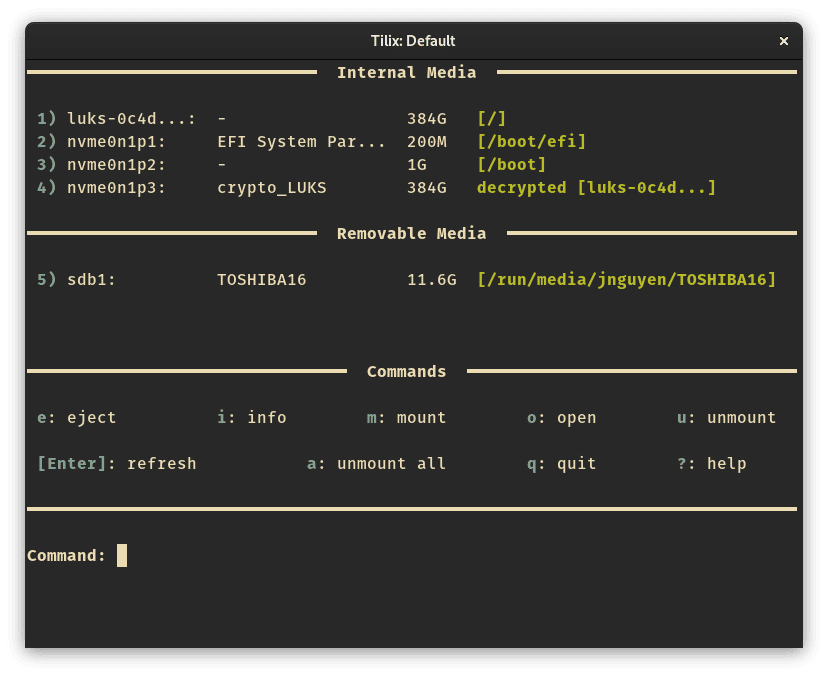
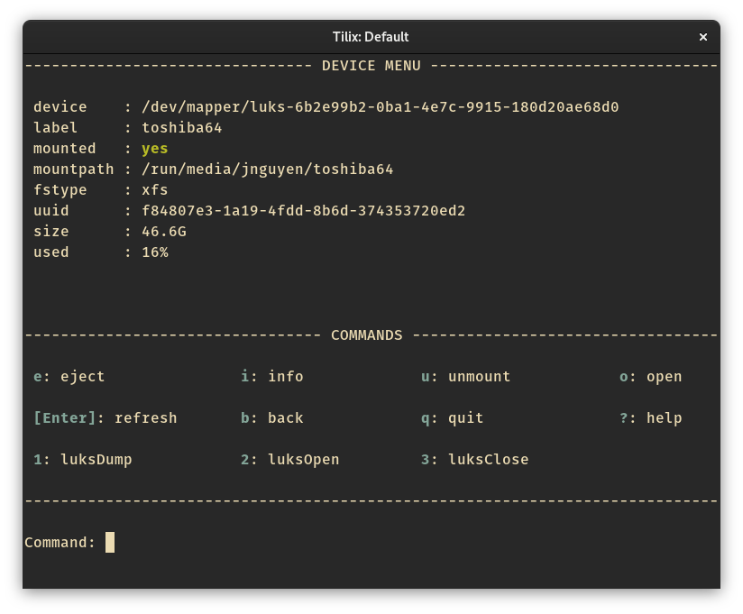

# bashmount

`bashmount` is a command-line tool to easily manage removable media.




## Installation

1. Install the
   [script](https://raw.githubusercontent.com/jamielinux/bashmount/master/bashmount)
   somewhere in your path (eg, `/usr/bin/bashmount`).
2. _Optional:_ Install the
   [configuration file](https://raw.githubusercontent.com/jamielinux/bashmount/master/bashmount.conf)
   at either `/etc/bashmount.conf` or `$HOME/.config/bashmount/config`.

There are also packages available for:

- [Fedora](https://src.fedoraproject.org/rpms/bashmount)
- [Arch Linux](https://aur.archlinux.org/packages/bashmount/)
- [Gentoo](https://packages.gentoo.org/packages/sys-fs/bashmount)

Add something like this to your `$HOME/.bashrc` to make life easier:

```
alias bm='bashmount'
```

### Dependencies

* `bash`
* `eject`
* Optional: `udisks2`

`bashmount` works best when `udisks2` is installed, so that regular users can
manage removable media without sudo.

## Configuration

`bashmount` works fine without a configuration file, but there's some neat
things you can do.

Have a look at the example
[configuration file](https://github.com/jamielinux/bashmount/blob/master/bashmount.conf).

- Open your desired file manager at the mountpoint of a device. (The default is
  to open in your terminal.)
- Hide certain devices from the list.
- Configure custom commands to run on removable devices.
- Automatically run custom commands after a mount or unmount.
